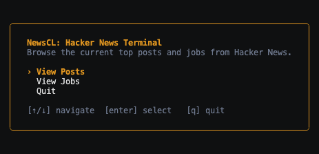
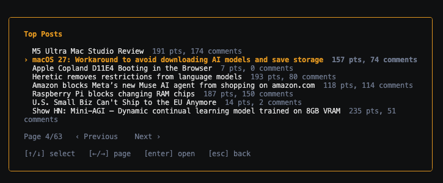

# News CL: Hacker News Terminal

A small terminal UI for browsing current Hacker News top posts and jobs, built with [Bubble Tea](https://charm.land/bubbletea) v2 and
[Lip Gloss](https://charm.land/lipgloss) v2. Data comes straight from the
public [Hacker News API](https://github.com/HackerNews/API).





## Features

- **Home menu**
- **Paginated lists**
  - "Posts" is `/topstories` with job postings filtered out, so it never
    overlaps with "Jobs" (`/jobstories`).
  - Item details are fetched lazily, one page at a time, and cached so
    paging back and forth doesn't re-hit the network.
- **Item popup**
  - `View Post` / `View Job` — opens the item's link (or its Hacker News
    page, for text-only posts like Ask HN) in your default browser.
  - `Comments` — opens the item's discussion page on
    news.ycombinator.com in your default browser.

## Requirements

- Go 1.25+
- A terminal

## How to start

From `~/newsCL`:

```sh
go run .
```

Or build a binary:

```sh
go build -o newscl .
./newscl
```

## Controls

| Screen            | Keys                                                                           |
| ----------------- | ------------------------------------------------------------------------------ |
| Home              | `↑`/`↓` navigate, `enter` select, `q` quit                                     |
| List (Posts/Jobs) | `↑`/`↓` select, `←`/`→` change page, `enter` open item, `esc`/`q` back to Home |
| Item popup        | `↑`/`↓` select option, `enter` open in browser, `←`/`q` back to list           |
| Error screen      | `r` retry, `←`/`q` back to Home                                                |

`ctrl+c` quits from anywhere.
